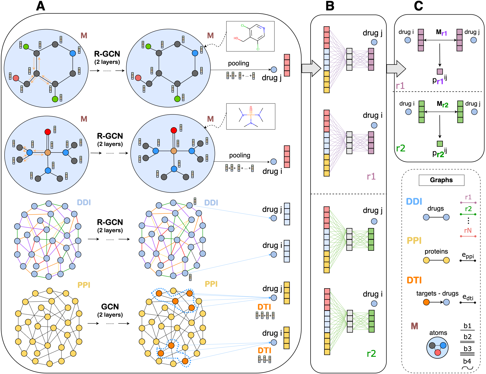

## MFSE: A Meta-Fusion Model for Polypharmacy Side-Effect Prediction with Graph Neural Networks
### Angelos Ragkousis, Olga Flogera, Vasileios Megalooikonomou

MFSE introduces a novel framework for the task of multi-relational link prediction with graph neural networks. Given a multi-relational graph, relation-specific vector representations are created for each node of the graph. When applying this strategy to the task of polypharmacy side-effect prediction, MFSE creates drug vector representations that are side-effect specific, by integrating external molecular and protein-target information with the drug information that is generated directly from the drug-drug interaction prediction graph. The AUROC metric of the model achieved an exceptional score of 0.95.

MFSE was presented in The 34th IEEE International Conference on Tools with Artificial Intelligence (ICTAI) and received the best student paper recognition award.

### Source Code

MFSE is developed with PyTorch, PyTorch Geometric and PyTorch Lightning.

